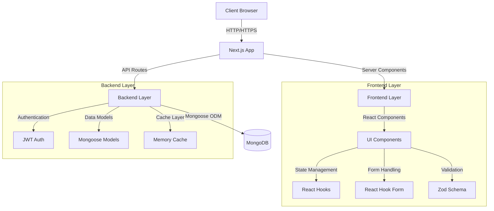
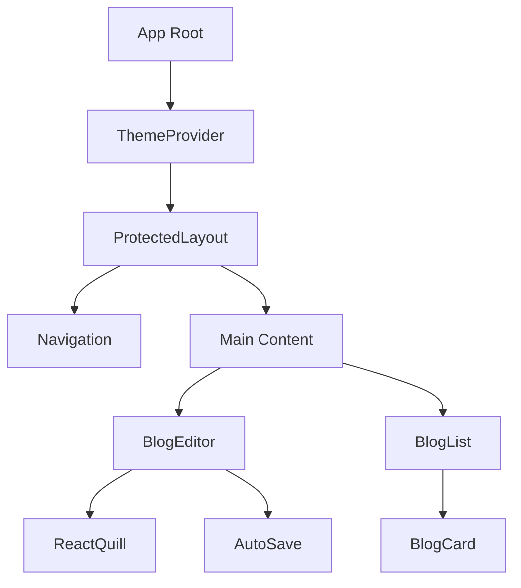

# 📝 Blog Editor - Modern Full Stack Blog Platform

A modern, feature-rich blog editor application built with Next.js 14, TypeScript, and MongoDB. Create, edit, and manage your blog posts with a beautiful UI and powerful features.

[](https://www.typescriptlang.org/)
[](https://nextjs.org/)
[](https://www.mongodb.com/)
[](https://tailwindcss.com/)


## 📌 Overview

This is a full-stack blog editor application that allows users to write, edit, save, and publish blogs with an auto-save draft feature. The application features a modern UI with dark mode support, responsive design, and a rich text editor.

## ✨ Key Features

### Frontend
- **Modern UI**: Clean, responsive design with dark mode support
- **Blog Editor**:
  - Title field with validation
  - Rich text editor (React Quill) with formatting options
  - Tags field (comma-separated)
  - Form validation using Zod schema
- **Blog Management**:
  - Save as Draft functionality
  - Publish functionality
  - Filter blogs by status (All/Published/Draft)
  - Sort blogs by date or title
- **Auto-Save**:
  - Automatic saving after 3 seconds of inactivity using debouncing
  - Visual indicators for save status
  - Toggle to enable/disable auto-save
- **Responsive Design**:
  - Works on mobile, tablet, and desktop devices
  - Adaptive layout for different screen sizes

### Backend
- **API Endpoints**:
  - Create/update drafts
  - Publish blogs
  - Retrieve all blogs
  - Retrieve blog by ID
  - Authentication endpoints (login/signup/logout)
- **Data Validation**:
  - Input validation on all endpoints
  - Proper error handling and feedback
- **Database**:
  - MongoDB integration via Mongoose
  - Efficient schema design

### Authentication & Security
- JWT-based authentication system
- Protected routes and API endpoints
- Secure password handling with bcrypt

## 🔧 Tech Stack

### Frontend
- **Framework**: Next.js 14 with App Router
- **Language**: TypeScript
- **Styling**: 
  - Tailwind CSS with custom configurations
  - Dark mode support
  - Responsive design
- **Form Management**: 
  - React Hook Form for form state
  - Zod for schema validation
- **UI Components**:
  - React Quill for rich text editing
  - Lucide React for vector icons
  - Framer Motion for animations
  - Sonner for toast notifications
- **Authentication**: JWT with HTTP-only cookies

### Backend
- **Runtime**: Node.js 18+
- **API**: Next.js API Routes (serverless)
- **Database**: 
  - MongoDB with Mongoose ODM
  - Optimized indexes
  - Connection pooling
- **Security**:
  - JWT for stateless authentication
  - bcrypt for password hashing
  - CORS protection
  - Rate limiting
- **Performance**:
  - In-memory caching
  - Response compression
  - Optimistic updates
  - Debounced auto-save

## 🏗️ System Architecture



### Component Architecture



## 🌐 API Endpoints

| Method | Endpoint             | Description                    |
|--------|----------------------|--------------------------------|
| POST   | /api/blogs           | Create a new blog or draft     |
| GET    | /api/blogs           | Retrieve all blogs             |
| GET    | /api/blogs/:id       | Retrieve a blog by ID          |
| PUT    | /api/blogs/:id       | Update a blog                  |
| DELETE | /api/blogs/:id       | Delete a blog                  |
| POST   | /api/auth/signup     | Register a new user            |
| POST   | /api/auth/login      | Login a user                   |
| POST   | /api/auth/logout     | Logout a user                  |

## 📋 Blog Schema

```typescript
{
  _id: string,
  title: string,
  content: string,
  tags: string,
  status: 'draft' | 'published',
  createdAt: Date,
  updatedAt: Date,
  author: Types.ObjectId
}
```

## 🚀 Getting Started

### Prerequisites
- Node.js 18+ (LTS recommended)
- MongoDB 6.0+ (local or Atlas)
- pnpm (recommended) or npm
- Git

### Development Setup

1. **Clone the Repository**
   ```bash
   git clone https://github.com/YOUR_GITHUB_USERNAME/blog-editor-web-application.git
   cd blog-editor-web-application
   ```

2. **Install Dependencies**
   ```bash
   # If using pnpm (recommended)
   pnpm install

   # If using npm
   npm install
   ```

3. **Environment Configuration**
   Create a `.env.local` file in the root directory:
   ```env
   # Required
   MONGODB_URI=your_mongodb_connection_string
   JWT_SECRET=your_secure_secret_key_min_32_chars

   # Optional
   NODE_ENV=development
   ```

4. **Database Setup**
   - Set up a MongoDB database (local or Atlas)
   - Use the connection string in your `.env.local` file
   - The application will create necessary collections automatically

5. **Run Development Server**
   ```bash
   pnpm dev  # or npm run dev
   ```

6. **Access the Application**
   Open [http://localhost:3000](http://localhost:3000) in your browser.

### Production Deployment

1. **Build the Application**
   ```bash
   pnpm build  # or npm run build
   ```

2. **Start Production Server**
   ```bash
   pnpm start  # or npm start
   ```

### Docker Setup (Optional)

1. **Build Docker Image**
   ```bash
   docker build -t blog-editor .
   ```

2. **Run Container**
   ```bash
   docker run -p 3000:3000 -e MONGODB_URI=your_mongodb_uri -e JWT_SECRET=your_jwt_secret blog-editor
   ```

## 📱 Demo

- **Home Screen**:
  
- **Blog Editor**:
  
- **Blog List**:
  

## 🧪 Implementation Details

### Key Features Implementation

#### 1. Auto-Save System
- Debounced save to prevent API spam (3-second delay)
- Offline support with localStorage backup
- Auto-sync when connection restored
- Visual indicators for save status

```typescript
// Auto-save with offline support
useEffect(() => {
  if (!autoSaveEnabled || !isDirty) return;
  
  changesSinceLastSave.current = true;
  
  const timer = setTimeout(() => {
    if (changesSinceLastSave.current && isValid) {
      handleAutoSave();
    }
  }, 3000);

  return () => clearTimeout(timer);
}, [watchedValues, isDirty, isValid]);
```

#### 2. Form Validation & Type Safety
- Zod schema validation
- TypeScript type inference
- Real-time validation feedback

```typescript
const blogSchema = z.object({
  title: z.string().min(3, 'Title must be at least 3 characters'),
  content: z.string().min(10, 'Content must be at least 10 characters'),
  tags: z.string().optional(),
  status: z.enum(['draft', 'published']).default('draft')
});

// Type inference
type BlogFormValues = z.infer<typeof blogSchema>;
```

#### 3. Authentication System
- JWT-based auth with HTTP-only cookies
- Protected API routes and pages
- Secure password hashing with bcrypt
- Session management

```typescript
// Protected route example
export async function GET(req: NextRequest) {
  try {
    const user = await getUser(req);
    if (!user) {
      return NextResponse.json(
        { error: 'Unauthorized' }, 
        { status: 401 }
      );
    }
    // Protected route logic
  } catch (error) {
    return NextResponse.json(
      { error: 'Internal server error' }, 
      { status: 500 }
    );
  }
}
```

#### 4. Performance Optimizations
- MongoDB connection pooling
- In-memory caching for API responses
- React memo for expensive components
- Image optimization with Next.js

```typescript
// Connection pooling configuration
const opts = {
  bufferCommands: false,
  maxPoolSize: 20,
  minPoolSize: 10,
  socketTimeoutMS: 45000,
  family: 4
};

// In-memory caching
const memoryCache: Record<string, {
  data: any;
  expires: number;
}> = {};
```

## 🧑‍💻 Development 

### Code Style Guidelines

Follow these practices for clean code:
- Use TypeScript interfaces and types for props
- Follow ESLint rules (provided config)
- Write meaningful comments
- Use proper component structure
- Follow React hooks best practices

### Folder Structure
```
src/
├── app/             # Next.js App Router pages
├── components/      # React components
│   ├── ui/         # Reusable UI components
│   └── ...         # Feature components
├── lib/            # Utilities and configurations
│   ├── models/     # MongoDB models
│   └── ...         # Helpers and services
└── hooks/          # Custom React hooks
```

### Testing
```bash
# Run tests
pnpm test

# Run tests with coverage
pnpm test:coverage

# Run E2E tests
pnpm test:e2e
```

## 📈 Roadmap

### Planned Features
- [ ] Real-time collaborative editing
- [ ] Image upload and optimization
- [ ] Comment system
- [ ] Analytics dashboard
- [ ] Export to various formats

### Performance Goals
- [ ] Lighthouse score > 95
- [ ] Core Web Vitals optimization
- [ ] PWA support
- [ ] SEO improvements

## 👥 Contributing

We welcome contributions! Please follow these steps:

1. Fork the repository
2. Create a feature branch (`git checkout -b feature/amazing-feature`)
3. Commit changes (`git commit -m 'Add amazing feature'`)
4. Push to branch (`git push origin feature/amazing-feature`)
5. Open a Pull Request

## 📄 License

This project is licensed under the MIT License - see the [LICENSE](LICENSE) file for details.

## 👨‍💻 Author

Built by Sai Charan
- GitHub: [charan22640](https://github.com/charan22640/blog-editor-web-application)

## 🙏 Acknowledgments

- [Next.js Team](https://nextjs.org)
- [Vercel](https://vercel.com)
- [MongoDB](https://mongodb.com)
- All our contributors
